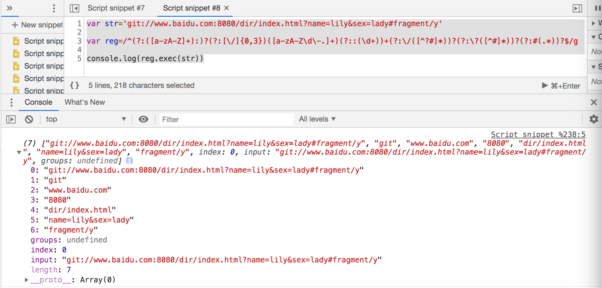

```js
var str='git://www.baidu.com:8080/dir/index.html?name=lily&sex=lady#fragment/y'

var reg=/^(?:([a-zA-Z]+):)?(?:[\/]{0,3})([a-zA-Z\d\-.]+)(?::(\d+))+(?:\/([^?#]*))?(?:\?([^#]*))?(?:#(.*))?$/g

console.log(reg.exec(str))
```
结果如下：



参考：《Javascript语言精粹》65页