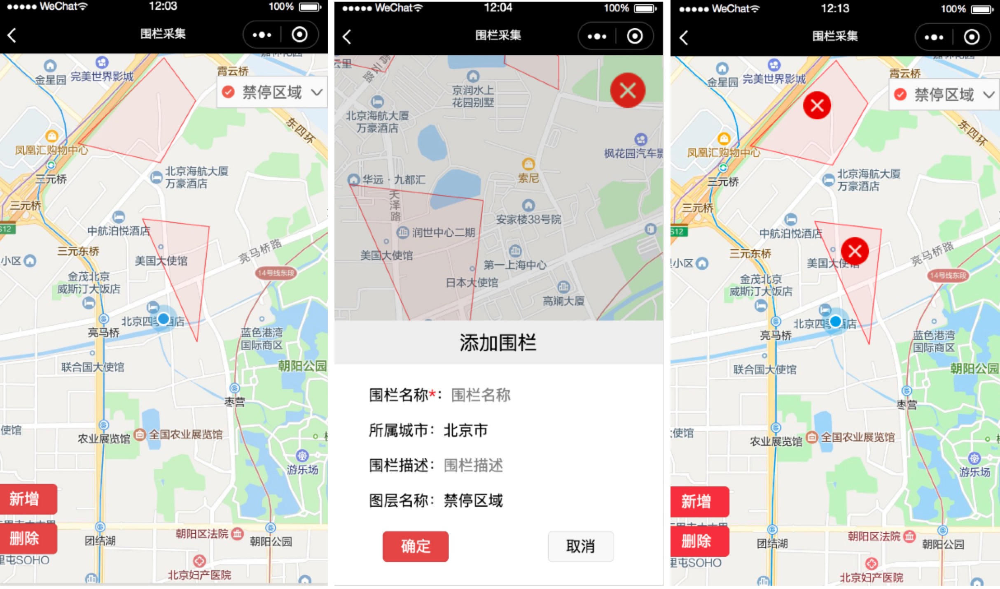
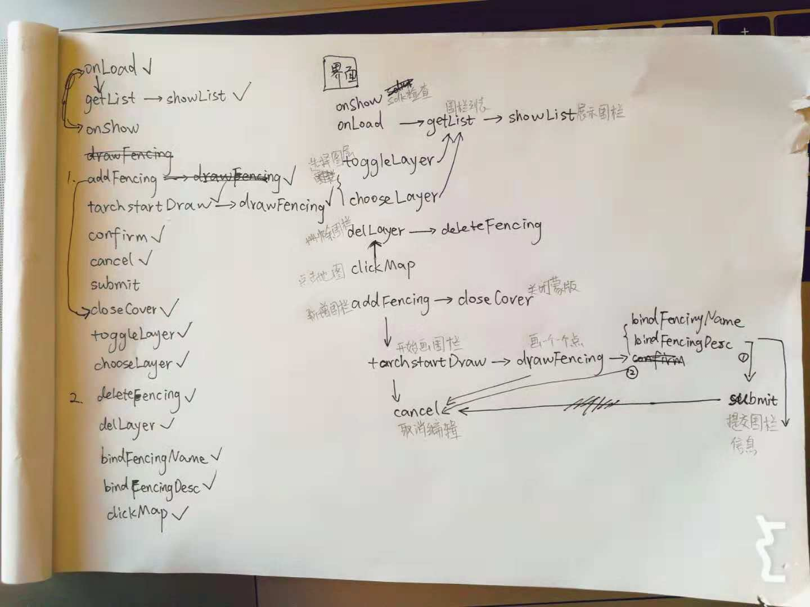

1、使用npm script，弃用gulp
原因：之前使用 gulp 多多少少有一丝高射炮打大象的意思。所以，经过分析之后，使用 npm script 构造该项目的工作流更轻量一些

构建所需核心功能：

less ——> wxss
图片压缩
生产环境使用热加载
执行脚本 bin/setdata.js
对应的实现办法：

lessc
imagemin
onchange
node ./bin/setdata
总的来说实现过程是：shell脚本 + node命令

 

2、围栏采集

功能：

- 围栏列表展示
- 新增围栏、编辑围栏信息
- 删除围栏
流程图：

画了一个可能只有自己看得懂的流程图

部分细节实现办法：

（1）菜单栏：选择图层

只能使用组件<cover-view>包裹图层名称，在地图上显示

真机上无法用wx:if 控制显隐，所以在此动态计算高度来控制显隐

（2）地图上画多边形

采用polygons 画多边形，并且填充颜色，但是仅在sdk2.3.0以上的版本支持。 所以，当用户很久没有更新微信版本的时候，围栏功能很有可能无法使用。还有一个问题是，在真机上如果多边形仅包含两个点，在地图上是没有显示的。

解决办法：同时引入 polyline多描一遍多边形的线条，适用于任何版本。使用watch 实现，代码简洁

（3）点击地图的时候，如何获取当前点击位置的经纬度

<map>组件是不支持点击事件直接获取经纬度的，所以在这里拐个弯儿去计算经纬度（李俊杰大佬帮忙攻破了这个难题）

实现办法：地图上覆盖一层原生组件<cover-view class="cover">，该组件能获取当前屏幕的具体点击位置[clientX, clientY]，同时通过MapContext.getRegion获取当前视野的西南角和东北角经纬度，结合这几个数据就能计算出当前点击位置的具体经纬度

（4）画地图的过程中，如果点击右上角的“关闭按钮”或者左下角的按钮，可以看到地图依然处于绘制状态，然而我们的本意并不是如此，如何解决该问题？

问题原因：绘画地图的过程中，不管点击右上角的“关闭”按钮还是点击左下角的“编辑”按钮，原生组件<cover-view class="cover">都会接收到触摸事件画出一个新的围栏节点，所以违背了我们的本意

解决办法：在整个屏幕上把功能按钮所在的那部分区域单独框出来，并添加<cover-view data-deletecover="true">，用户绘画过程中，当监测到当前的e.target.dataset 中的 deletecover=="true"之后，停止绘画，执行相应的功能。这种解决办法是万无一失的，且在真机上不会出现潜在风险

（5）编辑围栏信息功能的实现

从上边的截图我们可以看到编辑围栏信息的时候，页面的具体呈现

实现办法：用户画完围栏点击编辑之后，整个屏幕的下半部分弹出一个框，为用户提供编辑功能，上半部分用于显示地图，相当于此时地图高度缩小了50%。原本理想的页面呈现是直接在地图上弹出一个框，却遇到了太多各种各样麻烦的问题，所以采用现在这种办法，最起码保证功能上的完整且在各种真机上毫无差错。核心是，不让弹框覆盖在<map>组件之上。

（6）删除围栏功能的实现

常见的web网页上的围栏删除是如何实现的？比如，在做web网页的时候，使用腾讯地图提供的接口，可以为每一个围栏添加事件，这样删除、编辑一个围栏就变成了如此轻而易举的事情

然而，小程序里面的围栏是不能够添加事件的，所以应该怎么做？

细看官网可以看到<map>组件支持markers，并且markers支持点击事件，那是不是出现了这样一种实现办法：为每一个围栏的几何中心创建一个亲儿子marker，该儿子的id沿用该围栏的id，当儿子接收到点击事件之后，就能通过id 遍历围栏寻找到它的亲爸爸，把它和亲爸爸一起删除掉，整个删除流程就走完了。

开发经验：

（1）由于使用小程序<map>等原生组件限制太多，为避免可能出现的潜在问题（个别机型上的样式问题、功能异常），代码的每一部分都应该按照官网上明确指出的规范来书写

更多优化空间：

（1）运营人员体验上待优化

待随后接收到更多用户反馈，产品、技术的调研之后，应当在此基础上做出更多优化。希望能够提高画围栏的精确度，提升用户体验

（2）代码部分

看了高德地图、腾讯地图等提供的地图api 之后，内心油然而生666，这些api功能也忒丰富完善了。小程序里就没有这些api，并且很难通过引入h5顺利使用这些api，小程序小小的身躯恐怕承受不了这些。那么我在想，是不是可以手动在小程序里封装几个轻量型的api，便于使用，且便于扩展新功能。em........

 

3、位置采集
位置采集目的是采集当前位置的“经纬度”，从采集到上报数据都使用“火星坐标系”，该项目里我们使用精度是小数点后六位，意味着“1米”的误差

坐标系：

据俊杰小哥哥的讲解，国内普遍使用“火星坐标系”（gcj02）又叫“国测”，公司现在采用的也都是“火星坐标系”，这是国家标准。国际标准是gps坐标wgs84。这意味着，同一地理位置用两种标准获取到的经纬度数据是有差异的。同一个经纬度数据{ latitude: "39.949322", longitude: "116.467918"} 使用两种坐标系在地图上标示，显示位置也是不一样的，大概差一两个地铁站这么远。

注意事项：

小程序里提供的api有时候使用火星坐标系，有时候使用的是国际标准gps，使用的时候应当注意这里。

额外：

使用 wx.scanCode吊起客户端界面进行扫码的时候，会触发页面的onHide()事件，扫完码返回页面会调用onShow()事件

点击左上角返回会触发该页面onUnload()事件

