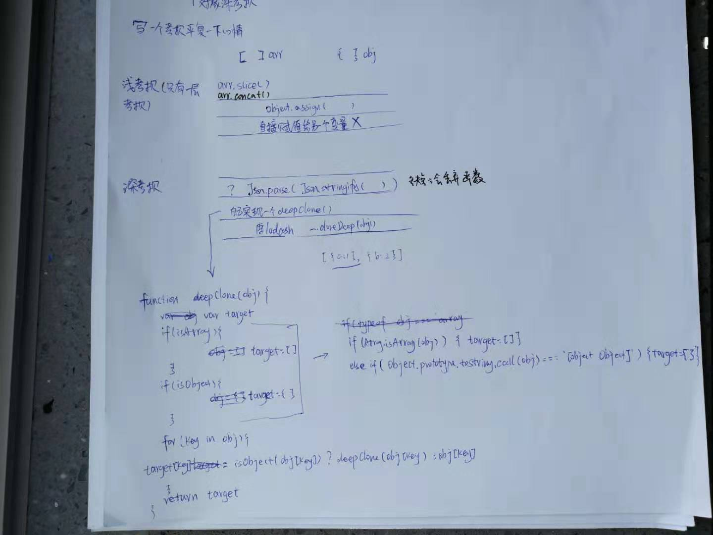

> 分析过程




> 代码实现

```js
function checkedType(target) {
   return Object.prototype.toString.call(target).slice(8, -1)
}

// 实现深度克隆：对象/数组
function deepClone(obj) {
    var target
    var targetType = checkedType(obj)
    if(targetType === 'Array') {
        target = []
    }else if(targetType === 'Object'){
        target = {}
    }

    for(key in obj) {
        // 下面注释这样是不可以的，不知道为什么
        // target[key] = (targetType === 'Array' || targetType === 'Object') ? deepClone(obj[key]) : obj[key]

        // 这里考虑某一项是函数
        target[key] = typeof(obj[key]) === 'object' ? deepClone(obj[key]) : obj[key]
    }
    return target
}
```