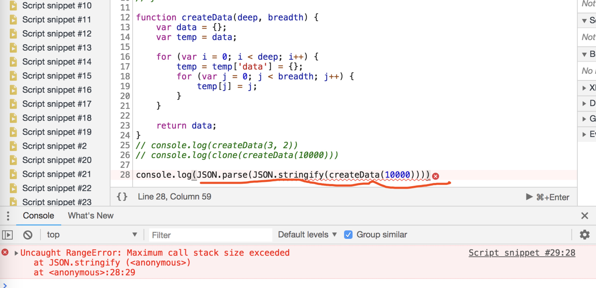
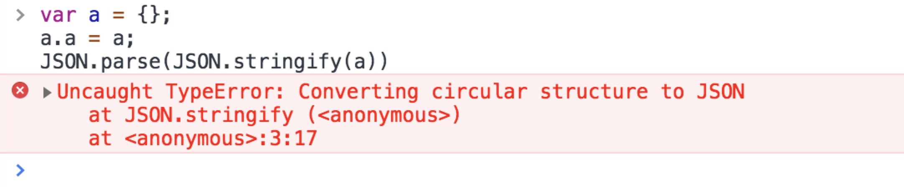

## 1、 最常见的深拷贝方式，使用递归

```js
// function clone(obj) {
//   if(typeof object !== 'object') {
//       return obj
//   }
//   var target = Object.prototype.toString.call([]) === '[object Array]' ? [] : {}
//   for (var i in obj) {
//     target[i] = typeof obj[i] === 'object' ? copy(obj[i]) : obj[i];
//   }
//   return target
// }
 
// 新的写法
function deepClone(obj) {
    var target = isObject ? {} :(isArray ? [] : '')
    for(name in obj) {
       let _clone = obj[name]
       target[name] = (isObject(_clone) || isArray(_clone)) ? deepClone(_clone) : _clone
    }
    return target
}
```

适用情况： 一般对象

意外： 因为使用递归，如果拷贝对象层级很深会爆栈。一般情况不会遇到层级很深的对象，什么情况下会遇到呢，不小心循环引用的时候会遇到。

时间复杂度：创建递归函数+每个对象处理时间

## 2、最容易实现的深拷贝方式，使用JSON.stringify

```js
function cloneJSON(obj) {
  return JSON.parse(JSON.stringify(obj))
}
```
适用情况：一般对象

意外：爆栈，循环引用报错，可以看下面两个截图


循环引用报如下错，是因为内部做了循环检测

时间复杂度：循环检测 + 每个对象处理时间 * 2 （递归转字符串 + 递归解析）

## 3、使用非递归方式实现深拷贝，实际上是深度优先遍历
适用对象：层级很多的，不保持引用关系的情况

优势：破解递归爆栈，由于不是递归的方式，所以不会出现爆栈的情况

缺点：依然无法解决循环引用的问题

```js
function cloneLoop(x) {
    const root = {};
    const loopList = [
        {
            parent: root, // 记录当前节点的父节点
            key: undefined, // 当前节点的键名
            data: x, //记录当前节点
        }
    ];
    while(loopList.length) {
        const node = loopList.pop();
        const parent = node.parent;
        const key = node.key;
        const data = node.data;
        let res = parent;
        if (typeof key !== 'undefined') {
            res = parent[key] = {};
        }
 
        for(let k in data) {
            if (data.hasOwnProperty(k)) {
                if (typeof data[k] === 'object') {
                    loopList.push({
                        parent: res,
                        key: k,
                        data: data[k],
                    });
                } else {
                    res[k] = data[k];
                }
            }
        }
    }
 
    return root;
}
```
时间复杂度：每个对象处理时间

## 4、基于上边的第三种方法加以改造，破解循环引用
适用对象：层级很多的，保持引用关系的情况

观察上边三种拷贝方式，不难发现都存在引用丢失的情况。如果不出现引用丢失的情况，是不是就能够破解循环引用的问题了呢。

实现办法：在上边第三种情况的基础上，将出现引用的项进行缓存，每次拷贝一个引用的时候，查看这这个对象是不是被拷贝过了，如果是的话，让键名直接指向这个对象就行

只需要在上边方法三上做一层判断就可以了，在此不想写代码了。

 

cloneForce

时间复杂度：缓存查找 + 每个对象的处理时间

 

 

##总：
clone时间 = 创建递归函数 + 每个对象处理时间   , (K + N) * n
cloneJSON时间 = 循环检测 + 每个对象处理时间 * 2 （递归转字符串 + 递归解析） , (M + N*2) * n 
cloneLoop时间 = 每个对象处理时间  , N * n
cloneForce时间 = 判断对象是否缓存中 + 每个对象处理时间    ，N * n * n
拷贝对象层级一般的时候，性能都差不多，速度由大到小排列：cloneLoop > cloneForce > cloneJSON > clone

层级很深的时候，速度由大到小：cloneLoop > cloneForce↓↓> cloneJSON↓ > clone

 
参考:  jsmini/clone

## 新增：升级对象深拷贝
最上边列举的自己实现深拷贝的方式存在几个问题：

- 边界情况处理有问题
- 无法破解循环引用
- 使用JSON方式完全忽略了这几项的拷贝：值为undefined、值为Symbol数据类型、值为函数类型
下面有一种神奇的办法完全解决了上面提到的问题：

```js
// 深拷贝
 
function deepClone(obj) {
    // 判断是否是对象{}, [], function等对象类型
    function isObject(o) {
        return (typeof o === "object" || typeof o === "function") && o !== null
    }
 
    //边界情况
    if(!isObject(obj)) {
        throw Error('不是对象')
    }
 
    //赋予初始值
    var target = Array.isArray(obj) ? [] : {}
 
    // 兼容Symbol类型，值为undefined，值为函数
    Reflect.ownKeys(obj).forEach(key => {
        target[key] = isObject(target[key]) ? deepClone(target[key]) : obj[key]
    })
 
 
    return target
}
```